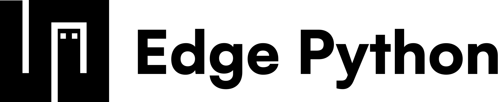

<div align="center">
  <a href="https://edgepython.com/" target="_blank">
    <picture>
      
    </picture>
  </a>
</div>

<br/>

The standard library of Edge Python, published to its registry as packages. A package that shares its name with a Python module behaves the way that module does, most of them over a Rust plugin compiled to WebAssembly.

- [Packages](https://edgepython.com/@dylan)
- [Modules](https://edgepython.com/docs/reference/modules)

## Using a package

> [!IMPORTANT]
> Before you proceed, install the CLI on macOS, Linux or WSL.
>
> ```bash
> curl -fsSL https://cdn.edgepython.com/cli/install.sh | sh
> ```

`edge add json` declares the package in `edge.json` and `edge lock` pins it, and then a program imports it by its bare name.

```python
import json

print(json.dumps({"hello": "edge"}))
```

## Repository

`edge/` holds each package as it is published, with its `edge.json`, `main.py`, `tests/` and `docs/`. `rust/` holds the plugins, each a crate its package imports as `_<name>`, and `make wasm` builds them all and puts each beside its package. Inside a package, `edge test` runs its tests.

## License

Every file in this repository is open source under the Apache 2.0 License, so importing, running or shipping these packages needs nothing from anyone. See [LICENSE](LICENSE).
